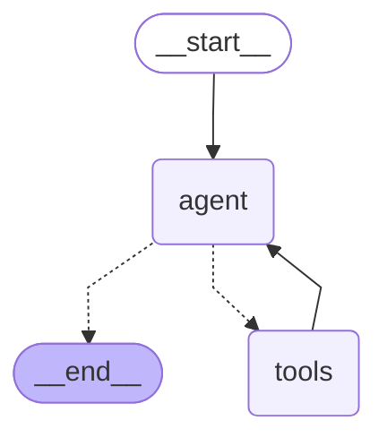

# tool-use-agent

A tool-use agent built twice — once in pure Python, once in LangGraph — to measure what frameworks actually buy you. Built as Day 4 of an AI Solutions Architect learning journey.

**What this demonstrates:**
- The full anatomy of a tool-use loop in plain Python (no framework)
- The same agent restructured as a LangGraph state machine
- Real APIs (Open-Meteo for weather, Tavily for search) — not mocks
- Native function-calling via Groq's OpenAI-compatible API
- Four production-class bugs discovered through adversarial testing

## The hero claim

**Frameworks don't add capability to agents — they add structure and observability.**

Both implementations execute the same loop, call the same tools, produce equivalent answers, and inherit the same LLM-side failure modes. The pure-Python version is 80 lines that fit on one screen. The LangGraph version is 50 lines structured as a state machine. They produce the same outputs. The architectural decision isn't "more powerful framework"; it's "which mental model serves my use case."

## Architecture

tool-use-agent/
├── src/tool_use_agent/
│   ├── init.py
│   ├── agent.py                     # Pure-Python agent (Phase 1)
│   ├── agent_langgraph.py           # LangGraph agent (Phase 2)
│   ├── tools_langchain.py           # @tool wrappers for LangGraph
│   └── tools/
│       ├── calculator.py            # AST-whitelisted math eval
│       ├── weather.py               # Open-Meteo HTTP client (no auth)
│       └── search.py                # Tavily search wrapper (auth)
├── run_agent.py                     # Pure-Python runner (5 queries)
├── run_agent_langgraph.py           # LangGraph runner (same 5 queries)
├── notes/agent-failure-modes.md     # 4 production-class bug findings
└── pyproject.toml                   # Editable install via pip install -e .

**Key design choice:** `tools/` is framework-agnostic. Tool functions work standalone, without LangChain or LangGraph. Then `tools_langchain.py` wraps them with the `@tool` decorator. **Same logic, two surfaces.**

This is the "wrap, don't modify" pattern: when adapting code to a framework, the framework sits *above* your business logic, not inside it.

## The anatomy of a tool-use loop

Every modern AI agent is a variation of this 4-part loop:

```python
messages = [system_prompt, user_query]

for iteration in range(MAX_ITERATIONS):
    # 1. Ask the LLM what to do
    response = llm.chat_completions(messages, tools=TOOLS_SPEC)
    msg = response.message
    messages.append(msg)
    
    # 2. Check for termination
    if not msg.tool_calls:
        return msg.content   # final answer
    
    # 3. Execute each tool the LLM requested
    for tool_call in msg.tool_calls:
        result = TOOL_REGISTRY[tool_call.name](**tool_call.args)
        messages.append({"role": "tool", "content": result, "tool_call_id": tool_call.id})

raise RuntimeError("Agent did not finish in time")
```

That's the entire agent. **No magic.**

The "intelligence" lives in the LLM's decisions about when to call tools and what to do with results. Your code is a coordination layer: send messages, parse response, run requested tool, append result, repeat.

## Pure-Python vs LangGraph — measured comparison

Both implementations were tested against the same 5 queries:

| Query | Pure-Python | LangGraph |
|---|---|---|
| Math: "73 × 14 + 219" | ✅ calculator → 1241 | ✅ calculator → 1241 |
| Single tool (weather) | ✅ Tokyo, 22°C | ✅ Tokyo, 20°C |
| Single tool (search) | ✅ Found Claude info | ✅ Found Claude info |
| Multi-tool (weather → calculator) | ✅ Showed self-correction | ✅ Skipped tool, did math in-prose |
| Adversarial 4-part query | ⚠️ 3 bugs surfaced | ⚠️ Same 3 bugs reproduced |

**Same final outcomes. Same failure modes. Different orchestration shape.**

## What LangGraph actually buys you

| Aspect | Pure-Python | LangGraph |
|---|---|---|
| Lines of orchestration code | ~80 | ~50 |
| Tool spec | Hand-written JSON (~30 lines) | Auto-generated from `@tool` docstrings |
| Tool dispatch | Manual `TOOL_REGISTRY` lookup | `ToolNode` handles it |
| Conditional routing | `if response.tool_calls:` | `tools_condition` + declarative edges |
| Visualization | None (debug via prints) | `agent.get_graph().draw_mermaid()` (free) |
| Persistence | None | Add `checkpointer=` to compile() |
| Streaming | Manual | Built-in via `.stream()` |
| Dependency footprint | groq + python-dotenv | langgraph + langchain-core + langchain-groq + transitive deps |

**LangGraph's value isn't fewer lines.** Both files are ~similar length. The value is **named abstractions** (nodes, edges, state), **standardized interfaces** (every node is `state -> dict`), and **emergent features** (visualization, streaming, persistence) you get without writing them yourself.

## The LangGraph agent's structure

The `langgraph` version compiles to this graph:



**Read this as:** Start → agent (LLM call). From agent, conditional split: if tool_calls present → go to tools node; else → END. After tools run, always loop back to agent. **Same logic as the pure-Python `while True` loop, expressed declaratively.**

This Mermaid diagram regenerates from code via `agent.get_graph().draw_mermaid()`. **Architecture documentation that can never go out of sync with the code.**

## Architectural patterns in this project

### 1. AST-whitelisted code execution (`tools/calculator.py`)

The calculator uses `ast.parse()` to convert math expressions into a syntax tree, then walks the tree allowing only operations in an explicit whitelist:

```python
_OPS = {ast.Add: operator.add, ast.Sub: operator.sub, ...}
```

`eval('__import__("os").system("rm -rf /")')` would be valid Python. The AST walker rejects it because `Call` nodes aren't in the whitelist. **Defense-in-depth via AST inspection, not blocklist or sandboxing.**

### 2. Tool dispatch via registry pattern

A dictionary mapping the LLM's tool-name string to the Python function:

```python
TOOL_REGISTRY = {
    "calculator": calculator,
    "get_weather": get_weather,
    "search_web": search_web,
}

# Generic dispatch — no per-tool branching
tool_fn = TOOL_REGISTRY[tool_call.function.name]
result = tool_fn(**parsed_args)
```

Adding a 4th tool is one line in the registry. Zero changes to the loop. **Same pattern as Day 3's ReAct classifier — registries scale linearly while if/elif chains scale quadratically.**

### 3. Errors-as-data, not exceptions

Tool failures don't raise exceptions through the agent loop. Each tool catches errors internally and returns them as readable strings:

```python
try:
    result = TOOL_REGISTRY[tool_name](**tool_args)
except Exception as e:
    result = f"Tool execution error: {type(e).__name__}: {e}"

messages.append({"role": "tool", "content": result, ...})
```

The LLM reads the error string in its next iteration and reasons about it. This enables **self-correction** — the LLM can see what went wrong and try a different approach.

### 4. Two-step API pattern (`tools/weather.py`)

Open-Meteo requires geocoding before forecast — `Tokyo` → `(lat, lon)` → weather. The pattern reflects real-world APIs:

```python
geo = requests.get(GEOCODE_URL, params={"name": city, ...}).json()
lat, lon = geo["results"][0]["latitude"], geo["results"][0]["longitude"]
forecast = requests.get(FORECAST_URL, params={"latitude": lat, "longitude": lon, ...}).json()
```

**Most useful APIs are two-step or three-step:** search → fetch, list → detail, lookup → action. Architects design tools to encapsulate the multi-step pattern from the LLM.

### 5. Layered timeouts and error handling

Every HTTP call sets `timeout=10`. Exceptions are categorized (network failure, malformed response, unknown). Different errors get different messages so the LLM can reason about them differently.

**Without timeouts, a hung API can wedge an agent indefinitely.** Architects always set timeouts on external calls.

## Production findings — 4 documented bugs

Real-world testing surfaced bugs that synthetic tests would miss. Each is documented in `notes/agent-failure-modes.md`.

### Bug 1 — Geocoding disambiguation failure

**Query:** "What's the weather in Bangalore?"  
**Result:** Returned weather for "Bangalore Town, Pakistan" instead of Bengaluru, India.  
**Root cause:** Open-Meteo's geocoder with `count=1` returns whichever location it ranks first. For ambiguous city names, that's not always the famous one.  
**Production fix:** Pass `count=5`, pick the result with highest population.  
**Class:** API contract user-hostility. Architects must always disambiguate ambiguous lookups.

### Bug 2 — Calculator natural-language confusion

**Query:** Multi-tool reasoning across weather and population estimates.  
**Result:** LLM passed expressions like `"Bangalore population in 2023 + 24 * Bangalore population in 2023"` to the calculator.  
**Root cause:** LLM treats each tool call as if it shares variable context with previous calls. Tools are isolated; the LLM didn't know.  
**Production fix:** Improve tool description to require literal numeric values; consider adding a "compute_from_value" tool that accepts both a value and an expression.  
**Class:** Tool-context isolation surprise.

### Bug 3 — Partial hallucination with graceful abandonment

**Query:** "What's the forecasted population of Bangalore in 2047?"  
**Result:** Agent returned "approximately 14,772,000" for 2026 (a number not in any tool result) but acknowledged "I could not find specific 2047 numbers."  
**Root cause:** LLM opportunistically uses training data alongside tool results.  
**Production fix:** Stronger system prompt: *"If no tool result confirms a fact, say you don't know rather than inferring from training data."*  
**Class:** Mixed grounding. Production agents need explicit "only-from-tools" mode for sensitive use cases.

### Bug 4 — Tool format hallucination (LLM non-determinism)

**Query:** Running the same query multiple times.  
**Result:** Llama 3.1 8B occasionally emitted `<function=get_weather>{"city": "Tokyo"}` (HTML-tag wrapper) instead of valid JSON. Groq's server rejected it with HTTP 400.  
**Frequency observed:** ~17% on small sample (1 of 6 calls), likely 5-10% steady state.  
**Production fix:** Use a larger model (`llama-3.3-70b-versatile` has dramatically lower hallucination rates), or implement retry logic.  
**Class:** Model capability mismatch. Smaller models can't reliably follow the tool-call protocol.

## The architectural lesson — when to reach for a framework

Based on this side-by-side comparison:

**Use pure Python when:**
- You have ≤5 tools and a simple control flow
- You want to read the entire agent on one screen
- You value debugging simplicity over abstraction
- You're prototyping and want maximum iteration speed
- You don't want to maintain a framework dependency

**Use LangGraph when:**
- You have many tools (10+) with complex branching workflows
- You need streaming for user-facing UIs
- You need persistence (pause/resume agents across sessions)
- You want graph visualization for architecture docs
- You have a team that benefits from standardized agent structure

**The architectural rule:** *Frameworks earn their complexity when the work you'd otherwise do is non-trivial AND likely to change.* For a 3-tool agent, LangGraph is overhead. For a 30-tool customer support agent with human approvals and multi-day conversations, LangGraph is invaluable.

## Quickstart

```bash
# Clone and install
git clone https://github.com/satyesh17/tool-use-agent
cd tool-use-agent

# Setup with uv (modern pip replacement — recommended)
uv venv .venv --python 3.13
source .venv/bin/activate
uv pip install -r requirements-lock.txt
uv pip install -e .

# Setup .env (see .env.example)
cp .env.example .env
# Edit .env to add GROQ_API_KEY and TAVILY_API_KEY

# Try the pure-Python agent
python run_agent.py

# Try the LangGraph version
python run_agent_langgraph.py
```

## Tech stack

- **Python 3.13** with `pip install -e .` editable install
- **[uv](https://docs.astral.sh/uv/)** by Astral — modern Python package manager (replaces pip; 10-100× faster)
- **[Groq](https://groq.com/)** — Llama 3.1 8B Instant for the LLM (free tier, OpenAI-compatible API)
- **[Open-Meteo](https://open-meteo.com/)** — Free weather API (no auth required)
- **[Tavily](https://tavily.com/)** — LLM-optimized web search (free tier)
- **[LangGraph](https://langchain-ai.github.io/langgraph/)** — Graph-based agent framework
- **[LangChain Core](https://python.langchain.com/)** — `@tool` decorator and message types
- **Auto-generated SDKs:** Groq's SDK is generated by [Stainless](https://stainlessapi.com/) from OpenAPI specs, using Pydantic for response validation — the same pattern as OpenAI's SDK

## What I learned

Three lessons I'd want a future colleague to know after reading this:

**1. The agent loop has no magic.** ~80 lines of Python implement the foundational pattern that powers every modern agent (ChatGPT plugins, Claude tool use, OpenAI Assistants). Once you've built it once by hand, every framework feels like decoration on the same loop. Same lesson as Day 2's provider abstraction: the abstraction is small; what matters is when to reach for it.

**2. Errors as data is a worldview, not a technique.** Day 2 returned errors in `LLMResult.error`. Day 3 ReAct used observation strings. Day 4 tools return error strings. Same pattern, three contexts. At some point this stops feeling like a technique and starts feeling like a worldview: *robust systems treat failures as inputs to reasoning, not as exceptions that abort it.*

**3. Adversarial testing finds what synthetic testing hides.** The 4 production bugs above weren't surfaced by my 4 happy-path tests. They were surfaced by one realistic multi-part query about Indian cities, weather, and population. **Real production agents need real production-shaped tests.**

## Related projects

- **[llm-comparator](https://github.com/satyesh17/llm-comparator)** — Day 2's multi-provider LLM benchmark, extended on Day 3 with schema-pass-rate measurement across 5 providers.
- **[email-classifier](https://github.com/satyesh17/email-classifier)** — Day 3's email classification with 5 prompting patterns and the same Pydantic validation philosophy.

---

**Built as part of [ai-architect-journey](https://github.com/satyesh17/ai-architect-journey)** — a public learning log toward becoming an AI Solutions Architect.